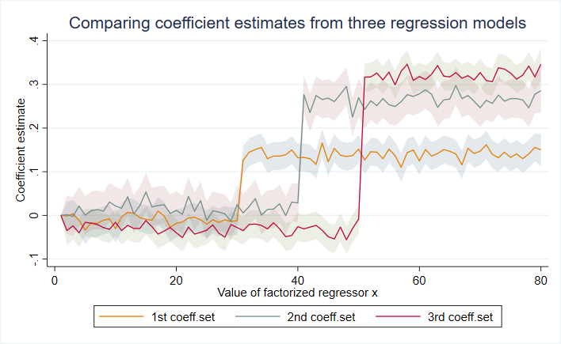

# Statapack

this is a collection of custom Stata programs that I use on a regular basis:

    EST_ADD
    EST_REPLACE
    PLOTAREA
    PLOTB 
    PLOTMEANS
    PLOTTABS
    TICTOC

The PLOT family of commands is particularly useful for visual analyses of admin data, enabling users to produce a variety of highly customizable plots **in a fraction of time required by Stata's native graphing commands**. Benchmarks at the bottom of this readme show that PLOTTABS attains at least 10 times faster processing times than the native command, with the efficiency gains growing with sample size. 
  
1. PLOTTABS plots conditional frequencies of observations (e.g., numbers of people observed each time)
2. PLOTTABS also plots conditional shares of binary variables (e.g., employment shares over time)
3. PLOTMEANS plots conditional means of any variables (e.g., average wages over time)
4. PLOTAREA plots conditional shares of categorical variables (e.g., industry shares over time)
5. PLOTB plots coefficient estimates of explanatory variables

Apart from speed gains, the key advantage of PLOT commands is that they allow the user to **store multiple graph data in memory and overlay them into a single plot**. The data are stored in a very efficient manner, requiring the bare minimum of operating memory. This facilitates comparisons across groups and models, and it is likely to prove extremely handy in early exploratory stages of empirical admin data projects. For example, you can use PLOT commands to visualize whether the dynamics of labor participation rate differ by gender or education attainment, or whether the magnitudes of your regression coefficient estimates differ between the candidate model specifications. 

To use these commands, simply execute the respective do-files in the Stata command line (or paste them into the preamble of your code). The examples below illustrate the workflow of all PLOT commands, and the corresponding dofiles contain more information about the commands and their options.  

Note: PLOT commands **only work with Stata 16 and above** because they leverage frame structures. These structures are essential for the speed and memory gains. Should you wish to access (and adjust) the graph data stored by PLOT commands, you can do so by changing your frame to 'frame pt':

    frame change frame_pt

Please also note that all these commands are a work in progress. The degree of customization differs from command to command, and bugs may occur. 
If you encounter an error, feel free to get in touch with a working example that demonstrates the error. 
If you like these commands and would like to help with converting them into proper .ado Stata routines with help files and all that, please get in touch too. 

## Example 1: Conditional frequencies with PLOTTABS

This example is equivalent to combining two histograms with discrete bin widths and option *freq*. 
However, the plot command is **10 times faster** than the native command. 
 
 

Code:

    webuse set https://www.jankabatek.com/datasets/
    webuse plotdata, clear
    qui do https://raw.githubusercontent.com/jankabatek/statapack/master/PLOTTABS.do
    // first histogram (gr=1), option clear erases previous PLOT data from the memory
    PLOTTABS if gr==1, over(x1) clear 
    // second histogram (gr=2), specify the visualization options: graph() type, overall twoway options() & graph-specific groptions() 
    PLOTTABS if gr==2, over(x1) graph(bar) options(title("Frequencies of observations, conditional on x") xtitle("x") ytitle("Frequency") legend(on order(1 "Group 1" 2 "Group 2")) xsize(7))  groptions(color(%50))

## Example 2: Conditional means with PLOTMEANS

This example plots conditional means of variable *y* (*x* is the conditioning variable) for ten groups of observations.
 
 

Code:

    webuse set https://www.jankabatek.com/datasets/
    webuse plotdata, clear
    qui do https://raw.githubusercontent.com/jankabatek/statapack/master/PLOTMEANS.do
    // conditional means for the first group (gr10=1), option clear erases previous PLOT data from the memory
    PLOTMEANS y if gr10 ==1, over(x2) clear
    // conditional means for the other groups, specify the twoway options & graph options
    forvalues g = 2/10{
        PLOTMEANS y if gr10 ==`g', over(x2) gray opt(legend(off) ytitle(y) xtitle(x) title("Means of outcome y for `g' groups," "conditional on x") xsize(6))
    }

## Example 3: Stacked conditional shares with PLOTAREA

This example plots how many observations belong to each of four mutually exclusive groups of observations, conditional on a specific value of *x*
 
 

Code:

    webuse set https://www.jankabatek.com/datasets/
    webuse plotdata, clear
    qui do https://raw.githubusercontent.com/jankabatek/statapack/master/PLOTAREA.do
    PLOTAREA gr4, over(x3) opt(title("Shares of observations belonging"  "to groups 1-4, conditional on x") xtitle("x") ytitle("Share") legend(on rows(4) pos(3) order(1 "Group 1" 2 "Group 2" 3 "Group 3" 4 "Group 4")) xsize(7))

## Example 4: Multiple sets of coefficient estimates with PLOTB

This example plots coefficient estimates and 95% confidence intervals corresponding to a factorized regressor *x* from three separate regressions. 
 
 

Code:

    webuse set https://www.jankabatek.com/datasets/
    webuse plotdata, clear
    qui do https://raw.githubusercontent.com/jankabatek/statapack/master/PLOTB.do
    // regression model 1
    reg z1 i.x3
    PLOTB i.x3, clear 
    // regression model 2
    reg z2 i.x3
    PLOTB i.x3
    // regression model 3
    reg z3 i.x3
    PLOTB i.x3, opt(title(Comparing coefficient estimates from three regression models) xtitle("Value of factorized regressor x") ytitle("Coefficient estimate") legend(on rows(1) order(4 "1st coeff.set" 5 "2nd coeff.set" 6 "3rd coeff.set")) xsize(6.5))

## Benchmarks against a native Stata graphing command

### PLOTTABS with 8M observations:

    . // Log file, run with Stata 17.0, OS Windows 10. Uses routine TICTOC that is part of statapack.
    . webuse set https://www.jankabatek.com/datasets/
    . webuse plotdata, clear 
    . expand 100
    (7,878,222 observations created)

    . // PLOT command
    . TIC
    . PLOTTABS if gr==1, over(x1) clear nogen
    1 - tabulating values for a new graph
      - plot type: line
    . PLOTTABS if gr==2, over(x1) graph(bar) 
    2 - tabulating values for a new graph
      - plot type: bar
    . TOC
    Elapsed time: 2.947 sec

    . // Twoway native command
    . TIC
    . twoway (histogram x1 if gr==1, discrete) (histogram x1 if gr==2, discrete)
    . TOC
    Elapsed time: 27.757 sec

-> PLOTTABS is **10 times faster!**; 

### PLOTTABS with 80M observations:

    . // PLOT command
    . TIC
    . PLOTTABS if gr==1, over(x1) clear nogen
    1 - tabulating values for a new graph
      - plot type: line
    . PLOTTABS if gr==2, over(x1) graph(bar) 
    2 - tabulating values for a new graph
      - plot type: bar
    . TOC
    Elapsed time: 12.367 sec

    . // Twoway native command
    . TIC
    . twoway (histogram x1 if gr==1, discrete) (histogram x1 if gr==2, discrete)
    . TOC
    Elapsed time: 323.938 sec
     
-> PLOTTABS is **more than 25 times faster!**    
