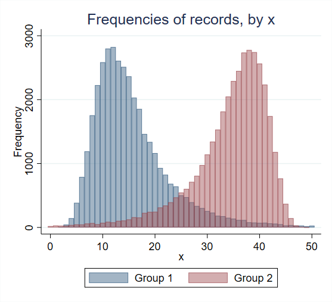
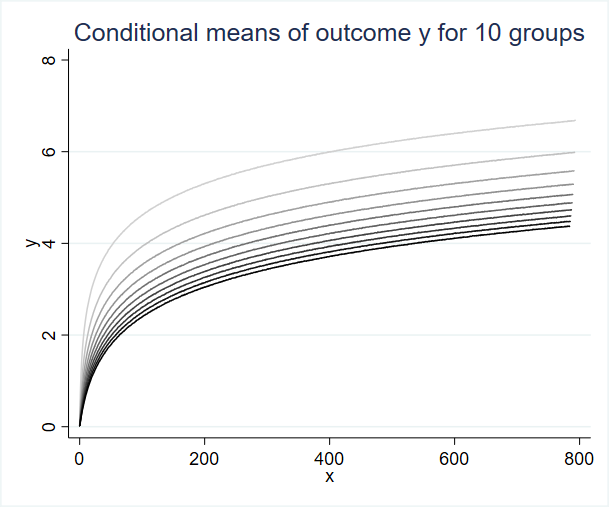
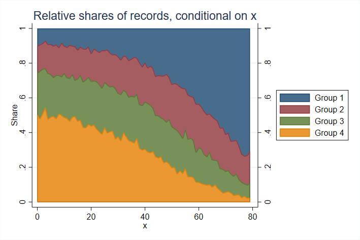

# Statapack

this is a collection of custom stata programs that I use on a regular basis:

    EST_ADD
    EST_REPLACE
    PLOTAREA
    PLOTB 
    PLOTMEANS
    PLOTTABS
    TICTOC

The PLOT family of commands is particularly useful, enabling Stata users to:
1. plot multiple conditional frequencies (e.g., numbers of workers by age and gender)
2. plot multiple conditional shares of dummy variables (e.g., employment shares over time by region)
3. plot multiple conditional means of variables (e.g., average wages over time by gender)
4. plot multiple conditional shares of categorical variables (e.g., industry shares over time)
5. plot multiple coefficient estimates of factorized regressors

The PLOT family has two main advantages: the commands are very fast, they use the bare minimum of memory, and they allow user to store multiple graphs in memory and overlay them into one plot. To use the commands, just execute the respective do-files in the Stata command line (or paste them into the preamble of your code). 

Note: PLOT commands only work with Stata 16 and above because they leverage frame structures. If you want to make it work for earlier versions of Stata, remove the frame structures from the code. 
If you like these commands and would like to help with converting them into proper .ado Stata routines with help files and all that, please get in touch. 

## Example 1: Conditional frequencies with PLOTTABS

This example is equivalent to merging two histograms with discrete bin widths (with option *freq*):
 
 

Code:

    webuse set https://www.jankabatek.com/datasets/
    webuse plotdata, clear
    qui do https://raw.githubusercontent.com/jankabatek/statapack/master/PLOTTABS.do
    // first histogram (gr=1), option clear erases previous PLOT data from the memory
    PLOTTABS if gr==1, over(x1) clear 
    // second histogram (gr=2), specify the visualization options: graph() type, overall twoway options() & graph-specific groptions() 
    PLOTTABS if gr==2, over(x1) graph(bar) options(title("Frequencies of observations, conditional on x") xtitle("x") ytitle("Frequency") legend(on order(1 "Group 1" 2 "Group 2")) xsize(7))  groptions(color(%50))

## Example 2: Conditional means with PLOTMEANS

This example plots conditional means of variable *y* (*x* is the conditioning variable) for ten groups of observations.
 
 

Code:

    webuse set https://www.jankabatek.com/datasets/
    webuse plotdata, clear
    qui do https://raw.githubusercontent.com/jankabatek/statapack/master/PLOTMEANS.do
    // conditional means for the first group (gr10=1), option clear erases previous PLOT data from the memory
    PLOTMEANS y if gr10 ==1, over(x2) clear
    // conditional means for the other groups, specify the twoway options & graph options
    forvalues g = 2/10{
        PLOTMEANS y if gr10 ==`g', over(x2) gray opt(legend(off) ytitle(y) xtitle(x) title("Means of outcome y for `g' groups," "conditional on x") xsize(6))
    }

## Example 3: Stacked conditional shares with PLOTAREA

This example plots how many observations belong to one of the four mutually-exclusive groups of observations, conditional on a specific value of $x$.
 
 

Code:

    webuse set https://www.jankabatek.com/datasets/
    webuse plotdata, clear
    qui do https://raw.githubusercontent.com/jankabatek/statapack/master/PLOTAREA.do
    PLOTAREA z, over(x3) opt(title("Shares of observations belonging"  "to groups 1-4, conditional on x") xtitle("x") ytitle("Share") legend(on rows(4) pos(3) order(1 "Group 1" 2 "Group 2" 3 "Group 3" 4 "Group 4")) xsize(7))